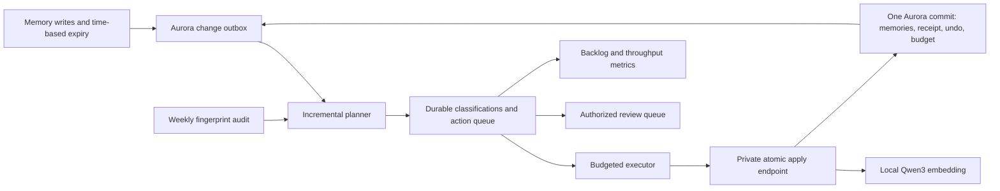

# Design: continuous memory consolidation

Date: 2026-09-28
Status: Design reviewed; implementation in progress; v2 not deployed
Baseline: `082bec7`; current behavior remains documented in
[ARCHITECTURE.md](../ARCHITECTURE.md) and [mem9-facts.md](../mem9-facts.md).

This proposal replaces the old weekly, scan-then-apply design. It does not
activate a new schedule or increase the current production mutation allowance.
The former design's unqualified claims about private review content in stdout,
unnamespaced digest keys, and race-free client-side absorbed deletes were stale.
Current logs contain counts only, digest keys include namespace, and the legacy
absorbed-delete leg still has a read/write race.

## Problem and intended outcome

### Preview schema-owner/runtime credential separation

Codex, GLM-5 and Opus 5.5 approved this increment before implementation. It
prepares numeric PR previews for eventual production credential cutover while
leaving production credentials, retirement gates and consolidation budgets
unchanged. It does not process the historical production backlog.

The preview application uses a stable SSM runtime login for the control and
normal tenant connections. Bootstrap alone receives the owner secret. Exact
table/column grants permit normal memory/session/ingest operations and required
namespace identity transactions. Backend membership uses `INHERIT TRUE`,
`SET FALSE`, `ADMIN FALSE`; existing caller-OID and membership guards remain.
The login has no DDL, ownership, temporary-object, grant-option, tenant-credential
write or direct maintenance-table permissions. Startup checks effective grants,
including inherited/PUBLIC and column ACLs. New tenant pools reject privileged
logins independently.

An owner-only binding fixes each visible tenant's ID, host, port, database,
username/OID, TLS and password fingerprint. A restrictive tenant SELECT policy
enforces the binding even beside an older permissive policy. Unapproved tenant
upserts/deletes invalidate readiness. The synthetic consolidation tenant uses
its separate stable backend login; its binding and registry row commit together
under the same owner bootstrap lock. No memory-write trigger is added.

`runtime-contract.sql` is a separate, hashed asset, excluded from normal schema
migrations. Both images use the same digest script. One dedicated owner
`pg.Client` acquires a nonblocking lock before invalidation and never reconnects.
Stamping requires that session still own the lock, the deadline remain valid,
all tenants be approved, and actual namespace constraints, required index
definitions and grants pass. The marker binds stage, runtime OID, packaged SQL
and live index definitions. A real kill-during-index-build rehearsal verifies
that readiness stays false and retry repairs only known invalid indexes.

CI first deploys runtime-only service wiring at zero tasks with scaling suspended,
then drains service tasks and all bootstrap revisions, including pending tasks.
It does not launch cached bootstrap before deployment. After successful owner
initialization, a second deployment always enables namespace enforcement,
`MNEMO_SCHEMA_MODE=verify` and one service task. Verify mode skips shell and Go
DDL, rejects unsupported runtime usage and requires the configured active tenant.
ECS invocations have prewritten SSM journals, explicit idempotency tokens and
absolute in-container deadlines. Cancellation recovers accepted-but-unobserved
launches without creating a second task. Unresolved records are retained.

Live verification inspects every active server task and its effective task
definition before and after the database probe. It requires the expected runtime
secret references, verify mode, one stable revision and no injected overrides.
It reads current IAM trust, boundary, inline policies and managed attachments,
requiring the exact reviewed runtime policies. The only permitted managed
attachment is the AWS-owned ECS execution baseline for image pulls and logs;
customer-managed or additional AWS-managed attachments fail verification.

Required gates include real PostgreSQL privilege/startup/recovery tests, the
actual rendered SST graph in both stages, and hard deployed runtime/MCP/ingest,
namespace, human OAuth and Scheduler/Qwen acceptance. Synthetic preview evidence
does not retire a production credential, certify model quality or calibrate the
24–72 hour backlog target. Those remain later release gates.

### Continuous scheduling preview increment

The scheduling design passed review by Codex, GLM-5 and Opus 5.5 before
implementation. Its acceptance scope is synthetic preview data. Production
activation, credential cutover, model certification, class fair shares,
retention and the 24–72 hour historical-backlog target remain separate gates.

Numeric `pr-N` stages provision separate planner and executor ECS tasks and
disabled hourly/15-minute Scheduler targets. Both workers receive only their
own database credential and target list; only the executor receives the
synthetic tenant key and consolidation signing key. Neither has inference
permissions in this rehearsal. Execution-role policies replace SST's wildcard
secret reader with exact SSM references and constrained KMS decryption, keeping
the ECR/log execution baseline. Production creates none of these credentials,
workers, schedules or synthetic databases.

Migration `007_consolidation_scheduling.sql` adds owner-configured dispatcher
settings, caller-OID capabilities and one renewable lease per worker kind.
Leases expire after 90 seconds and cannot outlive the fixed job deadline.
Persisted namespace rotation survives process restarts. The deployed acceptance
generation is pinned in task definitions and schedule input, and checked during
acquisition, renewal and target selection. Action/work leases and immutable
receipts still own data correctness. Scheduled executors cannot reserve a
second action concurrently in the same namespace.

The bootstrap's fixed preview operations create a journal-owned synthetic tenant
database on preview Aurora. Stable generated SSM credentials use SCRAM role
verifiers; sensitive SQL is parameterized and effective logging settings are
checked before credential setup. Setup does not disable server auditing. The
seed login actually inserts fixtures, then loses its grants and is retired
`NOLOGIN` with no remaining session before execution is enabled. The bootstrap
administrator remains a trusted administrator. The backend can acquire the
metadata locks required by namespace authorization but a trigger rejects its
metadata writes; it has no direct memory-write or policy-administration grant.

Each deployed commit/run/attempt selects fresh namespace IDs. An existing
generation is never reseeded or credited with a new batching proof. A partial
attempt requires a new deployment generation. Old journal-owned namespaces are
disabled before a new generation is enabled. Stage accounting is never reset:
the synthetic database has a 20,000-row daily ceiling, with explicit rejection
when there is insufficient headroom for another 150-row acceptance pass.

Acceptance uses actual one-time Scheduler deliveries at least 120 seconds in
the future, zero retries and a 60-second event age. Before creation, the harness
writes and reads back a metadata-only SSM journal. It correlates the exact task
revision, generation and invocation nonce, recovers prior journals, pauses
synthetic modes and removes temporary schedules on exit. The recurring targets
remain disabled. The runtime boundary denies task tagging, so Scheduler targets
omit tag propagation. Cross-stage task-ARN denies protect untagged tasks; optional
CI tagging is inventory-only and never grants cleanup ownership.

Setup task launches also have a prewritten operator journal and an explicit ECS
idempotency token. Recovery correlates and quiesces those tasks before the final
database pause. An absolute setup deadline is enforced by both the process
watchdog and the activation transaction, so a delayed unknown launch cannot
reactivate execution after recovery. Cleanup attempts seed retirement, operator
recovery, database pause and schedule removal independently, retains unresolved
journals and reports incomplete cleanup. Seed retirement runs on setup failure
and on recovery of an interrupted setup, including grant revocation and session
termination.

Fixtures contain 60 exact pairs plus one preclassified semantic pair in A,
10 exact pairs in B, and eight pairs with an eight-row budget in C. Orthogonal
synthetic vectors isolate unrelated neighborhoods. Setup creates only the known
semantic classification, never its action or execution receipt. The scheduled
planner must reuse that classification and queue the action; the private backend
must obtain a new embedding from local Qwen for changed content. One correlated
executor child must report more than 100 changed rows across at least two
batches. Expected changes are A=122, B=20 and C=8. A second executor wake must
change nothing and leave C's four pending actions budget-blocked. Protected,
pinned and incompatible-context fixtures remain unchanged; uncertified semantic
contradictions are explicitly deferred, not claimed as classified.

`scripts/consolidation-scheduler-e2e.mjs` is a hard preview CI gate. It also scans
bounded Aurora log pages in memory for credential-bearing structures. It never
retrieves passwords/salts/verifiers onto the runner, persists raw log pages or
prints them. The two log-read actions are scoped to preview database instances
in the existing IAM owner stack. Incomplete log coverage fails acceptance.
Before the first operator call, the harness records the newest PostgreSQL log
file and its size for each owned database instance. The final scan requires that
anchor to remain present and untruncated, scans all retained PostgreSQL files
including rotations, and checks downloaded byte coverage. An active log that
was last written before acceptance remains valid: a successful quiet interval
must not be mistaken for missing coverage by a `FileLastWritten` filter.
The local PostgreSQL rehearsal uses a deterministic embedding substitute; only
the deployed acceptance verifies Qwen and Scheduler. Neither proves real-memory
semantic quality or production backlog throughput.

A production pass examined 17,236 memories and 1,978 clusters. It committed ten
merge actions using the entire 20-row mutation budget: seven surviving records
were rewritten and thirteen fragments were soft-deleted. The 2,130 review or
deferral records included 2,089 `CAP_DEFERRED` actions, referencing 5,276 memory
IDs across those records. References are not a promise of that many deletions.
Eleven classification failures and three oversized clusters were separate cases.

The implementation completes an O(N squared) comparison of embeddings and all
model classifications before checking the execution budget. The observed pass
took approximately 151 minutes, including approximately 24 minutes of clustering.
The digest stores topic hashes, not executable decisions. A later run therefore
pays for classification again, including candidates left by the previous cap.

The redesign must deliver all of the following:

- Consume the existing automatically eligible backlog within the user-confirmed
  24–72 hour target under the calibrated service budget. Cases that require human
  judgment are excluded. The target was confirmed on 2026-09-28; eligibility and
  measured drain time still need validation, including for the 2,089 historical
  records.
- Discover newly changed memories without reclassifying the unchanged corpus.
- Continue applying durable candidates across task restarts and schedule ticks.
- Bound the blast radius of each atomic action and transaction, and enforce
  persistent risk budgets across all workers; a new task must not reset them.
- Preserve namespace authorization, current user edits, embeddings, provenance,
  pinned-memory semantics, and recoverability while increasing throughput.
- Make backlog age and net reduction visible. Successful task exit alone is not
  evidence that maintenance is keeping up.

No cleanup-volume target may be met by weakening validation, inventing model
confidence, reclassifying uncertain actions as safe, or counting review items as
completed work. Standalone DELETE and unresolved contradictions remain manual.

## Proposed architecture

Reuse the application-region Aurora database, private ECS cluster, local Qwen3
embedding sidecar, configured Bedrock routes, and existing alert delivery. Keep
account-global IAM ownership in its existing region and the independently
configured Responses route in its own region. No memory or embedding is sent to
an external provider. No additional public API, Lambda Function URL, vector
service, or cross-account authorization is introduced.

Before changing scheduled delivery, re-run
`scripts/deploy-decision-artifact-bucket.sh` when its existing bootstrap/lifecycle
contract needs updating, and verify the retained bucket and deploy-role
prerequisites documented in the README. The application continues to reference
the operator-owned audit bucket rather than taking ownership of it.



Planner and executor are separate bounded ECS tasks using the existing workload
image and separate entrypoints/task roles. Start the planner hourly and the
executor every 15 minutes. Each invocation enumerates only the existing private
maintenance target list and opens one authorized namespace context at a time.
The weekly schedule becomes a fingerprint/coverage audit, not the only chance
to execute changes. A daily due-time sweep handles age-driven staleness even when
no memory write occurs.

Scheduler delivery is a wake-up hint. It is not an exactly-once mechanism or a
budget boundary. Database claims and receipts supply those properties. A duplicate
or overlapping wake-up can exit as `lease_busy` without classifying or applying
anything. Do not recursively invoke ECS or introduce an unbounded task chain.

Initial compute candidates, subject to the performance gate:

- Planner: arm64, 1 vCPU / 2 GiB, fixed 50-minute lifetime, four concurrent model
  requests maximum across the stage, with persisted resumable work.
- Executor: arm64, 0.5 vCPU / 1 GiB, fixed 10-minute lifetime, one apply at a time
  per namespace and one maintenance embedding operation at a time per server.
- Drain several batches in one executor invocation until no eligible action,
  budget exhaustion, a breaker, or the fixed task deadline. A batch boundary
  must not mean waiting for the next day or week.
- All database transactions remain short. No lock is held during model calls,
  embedding generation, retry delays, or notifications.

The planner uses a fixed internal read-only service identity, following the
existing sampler pattern; it receives no mutation signing key. Its database role
can read authorized memory views and write planning metadata, but cannot UPDATE
or DELETE `memories`. The executor uses the existing consolidation capability,
receives its namespace signing key, and has no Bedrock inference grant. Its
restricted database role can claim work and read receipts through scoped queue
operations, not directly change memory rows. Namespace membership is checked in
these operations. The backend performs all memory mutations.

These are new role/grant contracts that require implementation and negative
tests. Separate command flags alone are not a security boundary. Until the
restricted database credentials replace the shared owner credential for these
tasks, do not claim that planner/executor write privilege is isolated. Backend
service authorization remains mandatory regardless of database-role separation.

Database grants are explicit: planner access uses namespace-authorized active
memory views and scoped functions for consuming changes and inserting immutable
proposals. It cannot edit existing proposal payloads, spend mutation budgets,
resolve operator reviews, or read protected undo images. Executor access is
limited to scoped claim/status/heartbeat operations and content-free receipts;
no direct memory DML or policy/suppression changes. Backend operations own commit
and accounting writes. Protected undo/export and policy changes require the
existing trusted namespace-owner/operator path. None of these identities is
selected by a caller-supplied principal ID or application-name label.

## Durable data and work states

Use separate maintenance tables, not the transcript-ingest queue. Reuse its
lease, immutable-plan, and transaction patterns without sharing its work state or
letting maintenance credentials enqueue transcript jobs.

Every key, lookup, conflict target, and relationship is namespace-bound. Queue
claims must never use a tenant-wide scan followed by an application-side filter.

| Data | Required contents and contract |
| --- | --- |
| `maintenance_changes` | Transactional memory-change notifications: namespace, memory ID, observed revision, event kind, claim generation and consumed state. No raw content in notifications. |
| `maintenance_work` | Coalesced dirty anchor/neighborhood work, generation, due time, lease and retry state. A new generation arriving while an old one is leased must survive acknowledgement. |
| `maintenance_classifications` | Immutable bounded input fingerprint, exact member set and versions, model/prompt/routing/policy versions, result, and validity deadline; includes KEEP and review outcomes. |
| `maintenance_actions` | Immutable proposal and input anchors, action hash, state, next eligibility time, expiry, monotonically increasing lease generation, and budget reservation. A result from a model cannot set authoritative eligibility or budget fields. |
| `maintenance_action_members` | Namespace/action/member mapping for invalidation and overlap detection. Historical member IDs can outlive soft or hard removal; missing current rows invalidate execution. |
| `maintenance_preparations` | One preparation per namespace/action/lease generation, owner generation, status, reservation and protected embedding fingerprint. |
| `maintenance_admission` | Persisted stage/namespace rate buckets, model reservations, concurrency slots and fairness credits. |
| `maintenance_suppressions` | Protected operator rejection/undo fences bound to namespace, members, action kind and semantic input. |
| `maintenance_budget_windows` | Persisted stage and namespace risk limits, used/reserved counters, policy version, and database-time window. |
| `maintenance_receipts` | One committed result per namespace/action, actual row transitions, before/post-image hashes, embedding version, and protected before-images needed for conditional recovery. |
| `maintenance_reviews` | Durable reasons, bounded protected proposal details and resolution state for manual decisions; independent of the content-free weekly digest. |

Plans, before-images and review content stay in operator-owned encrypted Aurora
storage. IDs, contents, hashes, embeddings, model output and error text never
enter public artifacts or ordinary CloudWatch output. Administrative reports
require current namespace access and owner-only export files. Metrics use stage
and, only where explicitly bounded, result/risk enums; no per-memory or
per-namespace identifier dimensions.

A classification/plan is not immutable if its payload can be edited under the same
ID. Enforce payload immutability in storage. Changing content, member snapshots,
policy or model context produces a new ID and invalidates the old action.

Action state machine:

```text
queued -> leased -> preparing -> applied | noop
                     |         -> invalidated -> new planning work
                     |         -> review
                     |         -> retry_wait -> leased with a new generation
queued/leased/preparing -> cancelled on authoritative policy/namespace disable
```

Automatic workers cannot transition `review` to executable state, including on
expiry. Restricted queue functions reject that transition. An authorized operator
may request re-planning against current inputs or cancel a review; this does not
approve a DELETE or bypass current policy. Rejection and undo create protected
semantic suppressions that automation cannot clear.

Budget waits retain `queued` state and an explicit `next_eligible_at` plus reason;
they are not human review items. `applied`, `noop`, and `cancelled` are terminal.
An invalidated action is never edited and replayed with fresh version numbers.

Use `FOR UPDATE SKIP LOCKED` for competing work claims, with bounded leases and
heartbeats based on database time. Claim, reservation, receipt lookup, recovery,
and expiry paths use one documented lock order. A generation token must still
match at the final write; expiration does not itself authorize an old worker to
finish. Database row ownership, not a process heartbeat, governs execution.

## Incremental discovery and model reuse

### Change capture

A transactional AFTER trigger captures INSERT, semantic UPDATE, state changes,
and DELETE for memory rows, including direct SQL maintenance and operator paths.
Notification insertion commits or rolls back with the memory transaction. It
must not call a network service. Namespace migration and backfill explicitly
invalidate coverage and schedule reconciliation work.
Outbox memory references are historical IDs without a foreign key to `memories`,
so capturing a hard delete cannot prevent that delete from committing.

Do not use `updated_at > last_run` as the only detector: existing stale marking
can advance version without changing that timestamp. Do not advance a single
sequence-ID high-water mark past uncommitted transactions either. Sequence
allocation is not commit order. Claim unconsumed outbox rows, upsert dirty work,
and acknowledge the specific claimed rows in the same transaction. A transaction
that commits late leaves a still-unconsumed row for the next claim.

Coalesce changes using separate `desired_generation`, `claimed_generation` and
`completed_generation` fields. An outbox upsert advances desired generation,
dirty fingerprint and due time without overwriting the active lease or claimed
generation. A claimant snapshots desired into claimed generation. Acknowledgement
advances completed only to its matching claimed generation and clears only that
lease; desired greater than completed remains eligible. Preserve unresolved
`first_seen_at` through retries, invalidations and successor work.

State transitions and changes in
membership, model configuration, routing policy and embedding version have their
own invalidation paths. Row changes from maintenance are not blindly suppressed:
a rewritten survivor can legitimately create new relationships. No-op detection,
action idempotency and unchanged-result caching address repeat requests, but do
not alone prevent rewrite churn. Automatic rewriting must absorb at least one
currently active validated donor and strictly reduce the active member count.
No standalone stylistic rewrite action exists. Require novel donor provenance
relative to committed lineage; automatic work cannot reactivate or create donors.
For a closed generation of N active memories, at most N-1 such merges can commit.
Alternating paraphrases without a new eligible donor therefore produce no-op/review
outcomes. Legitimate merges with additional donors may reuse a survivor, so a new
one-rewrite-per-day cap must not make large components take weeks to drain.
Track rewrite generations and lineage for audits; automation cannot clear undo
or rejection suppression to restart the cycle.

Use a due-time index to re-open staleness candidates at their next relevant age
boundary. A cached KEEP is not valid forever simply because content did not
change. A weekly paginated audit of IDs, versions and fingerprints detects
missed capture, imported rows and coverage drift; it enqueues changed work rather
than requesting fresh model output for every unchanged record.

### Bounded candidate neighborhoods

Replace the full in-process all-pairs comparison with namespace-restricted
candidate retrieval around dirty anchors. Reuse the exact-vector retrieval and
late-hydration patterns already validated by this project. Fetch content only
for selected candidates. Do not introduce a global ANN index that can leak
foreign-namespace candidates.

Start with at most 20 neighbors per anchor and the existing similarity threshold
as benchmark inputs, not guaranteed final quality settings. Candidate generation
must have stable ordering and a persisted paging/coverage cursor. Overlapping
windows are allowed for discovery but cannot authorize overlapping execution:
current member-version fences and invalidation govern each action.

A large connected component must not be skipped forever. Process it as bounded,
reviewable neighborhoods; retain overflow work with a cursor and revisit it.
Do not arbitrarily split a proposed merge merely to fit a budget, and do not
claim that a bounded neighborhood proves the whole component contradiction-free.
An individual action too large for the atomic/snapshot limits remains review-only.

Membership fingerprints include the exact selected member set, memory versions,
content and relevant metadata hashes, memory types/states, embedding revision,
retrieval-policy version and temporal validity. A newly added related memory
dirties its selected direct neighbors and relevant KEEP windows. Persist direct
reverse dependencies from windows to members. Each change enqueues its anchor
and a bounded page of direct neighbor/reverse-dependent windows, coalesced by
generation; overflow has a durable cursor and visible coverage debt. Invalidation
work does not recursively emit more invalidations: actual row changes do.
Debouncing repeated changes cannot reset oldest unresolved age. Weekly coverage
metrics expose candidates not yet visited; cached KEEP applies only to its exact
window, not an entire namespace.

### Classify once, drain many times

The planner first checks an exact classification fingerprint. Unchanged valid
results require zero new model calls, including KEEP and review results. A hit
never bypasses current execution fences. Re-routing an unchanged response after
a policy change requires fresh deterministic validation; an unsafe old policy
cannot be grandfathered into automatic execution.

Use a bounded stage-wide model semaphore and a persisted token/request budget.
Four parallel calls are an initial ceiling; adaptive backoff on throttling or
foreground load can lower concurrency to one. Never increase it implicitly to
meet a backlog target. Model and verifier versions are explicit configuration,
and every model call remains on the configured Bedrock route in its own region.

Persist each successfully validated neighborhood and its actions immediately.
A crash at the last neighborhood must not discard earlier classifications.
Classify new work independently of draining existing ready actions, so one slow
or invalid model response cannot block unrelated execution.

## Execution and atomicity

### Private apply contract

Add a private backend route, conceptually
`POST /v1alpha2/mem9s/maintenance/consolidation-actions/{action-id}/apply`.
It is accessible only to the signed consolidation capability in its authorized
namespace, not through public MCP tool discovery, a bare tenant key, human/M2M
transport, the analysis/planner identity, or a caller-provided principal.

The request identifies the stored action and current lease generation; it does
not contain arbitrary SQL, a replacement plan, a budget override, or a model's
claim that an operation is safe. The server loads the immutable proposal through
its namespace key and validates its policy/input fingerprint itself.

A MERGE proceeds as follows:

1. Check current namespace/service membership and action state. An already
   applied action returns its committed receipt; it must not regenerate an
   embedding or write again. A conflicting payload/hash for an existing action
   ID is rejected.
2. Use the single per-action reservation created atomically with the claim;
   the backend verifies it rather than reserving again. Establish the unique
   durable preparation and generate the canonical-content embedding through the
   local Qwen3 sidecar, outside the final mutation transaction. The executor
   never opens ports 8081/8082 and never writes a stale embedding directly.
3. Start the commit transaction. Recheck authoritative mode, policy, namespace,
   principal and membership under the existing authorization locks. Acquire the
   existing namespace cleanup mutex transactionally, then lock stage budget,
   namespace budget, action and all member rows in the documented order.
4. After acquiring all relevant locks, sample advancing database wall time with
   `clock_timestamp()`, not transaction-start `now()`. Recheck lease generation,
   expiry, reservation window, mode/policy epoch, plan validity, exact member set,
   active states, versions, content/context hashes and every action-specific
   eligibility predicate. A changed or absent donor invalidates the whole action.
5. Write the survivor content, embedding, metadata/provenance and version as
   needed; soft-delete the permitted donors with server-side predicates. Record
   all before/post images, actual transitions, receipt, used budget and released
   reservation in that same transaction. Commit once.

There is no successful state where only the survivor rewrite committed but a
later unversioned donor DELETE remains to run. A racing foreground edit causes a
complete abort/invalidation, not a partial merge. The legacy client's donor
pre-read does not provide this guarantee and must not be reused as the new
high-throughput write path.

For ARCHIVE, lock and validate both winner and loser, including both timeline
fields and the prior-stale-marker guard, in the same transaction. STALE updates
preserve content and embedding and are no-ops when already applied. Unfenceable
versions, unknown IDs, namespace mismatches or invalid provenance never become
retry-without-validation operations.

### Preparation and ambiguous outcomes

Reservations are per action, never an entire speculative batch. Claim one next
action per executor before preparation; the 100-row batch is a loop bound, not a
claim of 100 actions. Claims lock stage/namespace admission before the selected
action and create exactly one active reservation for it. An unavailable budget
or partial queue scan leaves no action lease or reservation behind.

Preparation states are `preparing`, `ready` and `abandoned`, with an owner
generation and uniqueness on namespace/action/lease generation. Concurrent
retries return `in_progress` for an active preparation instead of reserving or
embedding again. Persist the vector with namespace, exact input/content hashes
and embedding revision before mutation. It conveys no authority; a later valid
lease may reuse it only when every fingerprint still matches.

No receipt does not prove a failed commit. Status reads distinguish preparing,
prepared, applied and retryable work without exposing private payloads. Only a
recovery transaction holding admission/action locks may declare an expired
preparation abandoned: check for a committed receipt, advance the generation,
invalidate the old preparer, then release an unspent reservation. This works even
without a waiting claimant. A late preparer cannot publish over the new
generation or commit. Preparation retries have their own finite attempt limit.

Hold background-embedding admission until the underlying local model operation
finishes, including after HTTP disconnect; caller timeout does not prove that
inference stopped. Foreground/backpressure controls belong at that execution
boundary as well as in the worker.

### Lock and retry protocol

The v2 executor must not hold the legacy session advisory mutex while invoking
the backend: the backend would otherwise deadlock against its caller. The new
atomic route acquires the same `mem9-cleanup:<stage>:<namespace>` key itself,
using a transaction advisory lock. Old cleanup's session lock therefore still
excludes a concurrent v2 commit, while normal ingest is protected by row locks
and optimistic predicates.

Execution revalidation refreshes a scheduling/authorization record, never the immutable proposal. When only the revalidation interval expired, reuse the classification only after its exact inputs, policy and temporal validity still match. Changed inputs or an expired time-dependent verdict require new planning. This avoids forcing a 72-hour drain to redo unchanged model work every 24 hours.

Keep the order consistent in all paths: authorization rows; try-only namespace
mutex where required; stage admission then stage budget; namespace admission
then namespace budget; action; member rows sorted by ID. Claiming work must not
lock an action and then wait for a budget that a committer locks in the opposite
order. A nonblocking busy mutex requeues with
backoff. No embedding or model request runs while those locks are held.

An expired worker cannot finalize after a newer claimant has advanced the lease
generation. Reservation expiry is reconciled under the same locks; it must not
release capacity while an old commit can still succeed. Cross-day reservations
expire for new authorization at the UTC boundary. An advancing-clock check after
lock acquisition chooses and records the authorization window; an old-window
reservation is released and re-claimed without memory writes. Do not use a time
sampled before a lock wait. A valid commit decision retains its locks, so a
reclaimer cannot run past it; its receipt settles that window even if WAL flush
crosses midnight. These are authorization-window budgets, not a guarantee of
instantaneous physical commit. Persisted short-term rate buckets separately bound
a two-window burst. Test lock waits across both lease expiry and midnight.

On an ambiguous HTTP result, read the same action receipt. If committed, return
that result; if definitively uncommitted, retry the same immutable action and
current lease protocol. Never create a new action ID to bypass an uncertain
receipt or reset a budget. Namespace disable/revocation and policy pause are
checked in the write transaction; revocation is not inferred from a stale
planner snapshot.

## Throughput controls and initial policy envelope

A mutation means an actual row state/content/metadata transition, not a model
action, HTTP request, task launch, or memory scanned. A merge may retain an
already complete survivor without rewriting it, and may absorb multiple donors.
Reserve worst-case rows before work and settle actual changed rows at commit.
Repeated changes to the same row consume budget again. Retries of one committed
action consume it once.

The values below are **proposed calibration settings**, not production changes.
They must pass the quality and load gates before activation. The acceptance
question is whether the measured ready backlog can drain within its target,
not whether a larger arbitrary constant can be substituted for 20.

| Control | Initial proposal | Purpose |
| --- | --- | --- |
| Per semantic MERGE | At most 10 input records, existing content/tag limits, and at most 1 MiB protected before-images | Bounds one atomic failure/recovery unit; oversize becomes review |
| Executor batch | At most 100 reserved changed rows, then start another eligible batch in the same run | A transaction/work subdivision, not a weekly allowance |
| Namespace daily total | `min(3000, ceil(0.20 * active_at_window_start))` actual row transitions | Persistent aggregate risk envelope |
| Namespace daily canonical rewrites | `min(1000, ceil(0.06 * active_at_window_start))` | Separately limits semantic rewriting |
| Namespace daily soft deletions | `min(2000, ceil(0.12 * active_at_window_start))` | Separately bounds net reduction |
| Archive | `min(500, ceil(0.03 * active_at_window_start))`, also charged to total | Independently limits timeline-based removal from active recall |
| Metadata-only marking | Charged to the total, with a reserved fairness share | Cheap tagging cannot starve consolidation |
| Stage total | Initially 3,000 changed rows/day for the present single namespace; multi-namespace expansion requires an explicit stage ceiling | Adding namespaces or tasks does not multiply the account budget |
| Model capacity | Required daily request/input/output-token limits from the shadow-run measurement; reserve worst-case output before each request and settle actual usage | No unlimited inference or automatic model-budget escalation; missing limits block enablement |
| Apply rate | Initially at most 2 changed rows/second with a 100-row burst and one server maintenance embedding at a time | Protects foreground recall/write service |
| Execution revalidation | At most 24 hours between full input/policy revalidation, plus fresh fences at every commit | An unchanged, temporally valid classification can be reused without another model call |
| Retry | Three bounded attempts for transient failures, then durable review/error state | No infinite bad-model or transport loops |

For approximately 17,000 active memories, the proposed steady-state envelope is
up to 3,000 changed rows/day, including at most 1,000 rewrites and 2,000 soft
deletions, subject to the shared total and stage limits. This is materially
different from 20/week while remaining bounded. It is not authorization to use
those limits before rollout acceptance.

The 5,276 historical ID references suggest the order of magnitude of work, but
are not an executable row budget: actions can overlap, be invalid, require fewer
writes, or become stale. The new planner computes valid worst-case and actual
costs. The acceptance report must show the resulting drain ETA and whether the
user-confirmed 24–72 hour target fits the calibrated daily/rate/model limits.
If not, explicitly revise policy or capacity; do not hide the miss as a
successful empty run.

Persist stage/namespace counters and reservations using database time. Restart,
manual invocation, duplicate schedule delivery, worker count and a new run ID
cannot reset them. Limits come from a versioned operator policy, never a model
field or unbounded CLI `--cap`. Snapshot the active eligible-memory denominator
(excluding session rows and other namespaces) once per window, with
policy version and workload bounds recorded, so writes cannot inflate their own
allowance mid-window. Lower limits and pauses take effect at the next uncommitted
action; committed mutations remain accounted for.

### Distributed admission and fairness

Stage and namespace token buckets live in `maintenance_admission`. Refill under
row lock using advancing database time and enforce both rate and burst. Admission
is conditional across all relevant dimensions, including used and reserved
capacity. Stage limits and namespace allocations must be validated before
activation; adding a target cannot create a fresh stage allowance.

Model admission reserves one request, a certified conservative input-token bound,
and the configured maximum output-token bound in one transaction, then claims one
of four stage-wide client-request slots. Include protocol/reasoning usage under
the pinned adapter contract; unsupported counting or unenforced provider limits
block enablement. Settle known usage once. Unknown usage is conservatively
charged at its reserved maximum, not refunded. A retry requires a new accounted
attempt; cache hits consume none. Client timeouts can outlive remote computation,
so the concurrency bound describes admitted client attempts. Bound outstanding
unknown outcomes and pause admission at the configured uncertainty limit.

Allocate durable per-window namespace and class credits. Initial class shares
are semantic merge 50%, exact deduplication 30%, archive 10%, marking 10%, subject
to every risk ceiling. These are scheduling shares, not extra quota. Protect them
before borrowing; lend only unreserved excess from an empty class after a
configured late-window cutoff. A class becoming busy reclaims unspent loans and
stops further lending. Committed loans cannot be refunded: late arrivals get
next-window priority, with oldest unresolved age preserved, rather than a false
same-window guarantee after the capacity has already been spent.

Within a class, select oldest eligible work with persistent round-robin namespace
slices. Give an aged backlogged namespace/class a turn for its oldest affordable
action before lower-priority work in a new window. Bound hot-record retries. If a
valid action cannot fit even an empty configured window, mark it `policy_blocked`,
alert and expose the missed drain target. Do not wait forever, split the merge
arbitrarily, or relabel it as completed/review to improve the SLO. Budget-blocked
and discovery-overflow ages remain part of the acceptance report.

Human review is separate. Automation cannot promote it by age or clear operator
rejection/undo suppressions.

## Quality, provenance, and recovery

Automatic standalone DELETE remains prohibited. Ambiguous contradictions,
unsupported actions, hallucinated IDs, conflicting actions and invalid/missing
provenance remain durable review items. The new queue fixes throughput, not the
correctness of arbitrary model suggestions.

- Deterministic exact-duplicate treatment is allowed only when the namespace,
  memory type and all material context agree. Equal content alone is insufficient
  when project tags, source context, protection or provenance differ.
- A merge must preserve the supported facts, qualifiers, timeline distinctions,
  tags/protection semantics and source provenance of every donor. Never silently
  truncate context to fit the 20-tag or content-size limit; defer the action.
- Canonical semantic rewrites require an explicit policy version and an
  independently evaluated preservation check. A model's self-reported confidence
  cannot grant permission or remove deterministic fences. The verifier's own
  output is untrusted and is not proof of perfect semantic correctness.
- Cache classification/verification by exact input and policy fingerprints.
  Missing/failed verification creates review work and does not consume a memory
  mutation budget. Sampled quality audits and foreground recall regression tests
  are release/operational gates, not just schema checks.
- Atomic receipts retain protected full before-images and exact post-image
  fingerprints for 30 days initially. Do not truncate undo state; an action too
  large for the snapshot bound is not automatic. Purge terminal payloads after
  retention while retaining content-free accounting/tombstones needed for
  idempotency. An old purged action can never be re-executed under its old ID.
- Recovery is a new, audited, namespace-authorized operation that succeeds only
  if every current row still matches the recorded post-image. A later human or
  ingest edit blocks automatic restoration. Recovery never blindly overwrites
  newer content or clears the original receipt. Restore with new monotonically
  advancing versions; never restore an old version number and create an ABA hole.
  Protected suppression prevents automatically repeating the same semantic action
  on unchanged facts until the operator clears it or genuinely new semantic input
  requires fresh review. Planner/executor roles cannot clear these records.

Stop admitting new mutations on authorization or namespace mismatch, impossible
budget/receipt counts, unexpected embedding dimensions, failed atomicity checks,
or a confirmed semantic-loss report. Runtime transport failures use bounded
backoff; a sustained failure rate pauses the affected namespace. High foreground
latency/resource pressure lowers rate or pauses maintenance. Set quantitative
thresholds from the paired load benchmark; a green task exit is not the breaker.

## Observability and operator contract

Aurora receipts and budget rows are authoritative. Post-commit EMF is best effort
and is reconciled against them; missing metrics must never make a committed
mutation eligible again.

Use a v2 metric namespace/dashboard so the meaning of legacy full-pass metrics
is not silently changed. Preserve current alarms during the staged migration.
New signals include dirty work, ready actions, budget waits, oldest eligible age,
model calls and cache hits, committed action counts, content rewrites, soft
deletions, archives, metadata-only changes, invalidations, retries, lease expiry,
review reasons, paused state, and foreground latency regression. Publish only
bounded stage/result/risk dimensions and content-free failure classes.

Alert on a ready backlog that exceeds its drain-age target, repeated exhausted
budgets with an increasing backlog, failed change-capture/audit coverage, absent
worker heartbeats, sustained model/embedding failures, and any invariant breach.
One legitimately empty queue is healthy. Distinguish `idle`, `budget_wait`,
`lease_busy`, `progress`, `review_required`, `paused`, and `failed` outcomes.

The weekly digest is a view of durable work and receipts. `CAP_DEFERRED` becomes
budget-wait work, not an ever-growing human review list. Human review content is
accessible only through authenticated namespace-bound operator tools; Slack
continues to carry counts only until its namespace/destination contract is
explicitly implemented. Digest delivery failure must not replay memory actions.

## Rollout, migration, and rollback

Production currently retains the legacy weekly schedule and 20-mutation limit.
This document is not an instruction to change them during design review.

1. Add maintenance schema, change capture, restricted database roles, immutable
   classifications and queue operations under versioned migrations. Rehearse
   additive/enforced/frozen states and schema rollback against real PostgreSQL.
   Update the reviewed SQL inventory; measure trigger overhead before enablement.
2. Ship the private atomic apply route, server allowlist and authorization
   fences, receipts, protected undo, and budget accounting. Test commit/response
   loss and races with real ingest and membership changes. No raised production
   budget is permitted before this route is verified.
3. Deploy planner/executor tasks and Scheduler configuration disabled/report-only
   in preview. Rehearse namespace isolation, duplicate launches, lease takeover,
   queue continuation, foreground load and all budget boundaries. Reuse existing
   same-account networking and out-of-band resource ownership; review new IAM
   grants/boundaries and the synthesized plan before deployment.
4. Bootstrap a fresh durable plan from current rows. The old content-free digest
   and `CAP_DEFERRED` log records cannot be imported as executable actions because
   they lack content/version anchors and canonical output. Reuse only genuinely
   complete, validated input fingerprints; never reconstruct private decisions
   from metric counts.
5. Fence legacy writers **before** v2 can commit. This is a stage-wide credential
   cutover because server, tenant, bootstrap and legacy maintenance currently
   share the owner database credential:
   - Keep v2 writes paused. Disable the real legacy Scheduler resource, block new
     legacy task starts, and revoke maintenance execution-role access to the owner
     secret. These steps alone do not invalidate cached passwords.
   - In a reviewed maintenance window, stop/drain affected old writers and set the
     deployment interlock. Rotate the shared credential (or retire its login),
     update Secrets Manager and real per-tenant credentials together, and terminate
     remaining sessions authenticated with the retired credential. Application-name
     labels are diagnostics, not identity. Rehearse and disclose service impact.
   - Restart and verify server/bootstrap through their refreshed authorized path.
     New maintenance tasks receive only restricted roles. Prove that old passwords
     cannot reconnect, old sessions cannot write, and old task revisions cannot
     retrieve replacement owner credentials before enabling v2.
   - Database privileges deny direct maintenance DML and permit only scoped queue
     operations; the server performs atomic memory commits. Do not impose an action
     ID trigger on ordinary user/ingest writes. A trusted database administrator is
     explicit break-glass authority outside the automation guarantee.
   - Switch namespace mode/policy epoch only after these gates. Mode updates take
     an exclusive lock on the policy row that commits retain under a shared lock;
     preparations from an old epoch cannot commit. The backend rejects legacy
     consolidation REST writes in v2 mode as a second barrier. There is no interval
     where legacy automation and v2 can both commit.
6. Run a bounded canary, inspect semantic preservation and undo evidence, then
   promote the reviewed policy to its calibrated steady-state envelope. This is
   a release gate, not a per-batch/per-week human confirmation flow. The rollout
   is incomplete while a canary-sized quota remains the permanent default.
7. Drain valid backlog, verify the stated target and steady-state behavior, and
   retain the weekly audit/review digest. Publish source/receipt-based progress,
   not only successful ECS exits.

Rollback pauses new claims and commits through the authoritative mode first,
lets/rejects in-flight work under the lease/transaction rules, and retains durable
receipts/plans for reconciliation. Never re-enable legacy apply while v2 can still
commit. Keep the new authorization guard through rollback; restoring old binaries
that ignore mode must not reopen the legacy write path or regain the retired
credential. Credential/session retirement is not rolled back; recovery retains
the fenced server path. Optional data undo uses
post-image fences and is distinct from rolling back code.

## Acceptance gates

Detailed planned cases are in
[test-cases/weekly-memory-consolidation.md](../test-cases/weekly-memory-consolidation.md).
Implementation is complete only when evidence proves:

1. A synthetic workload shaped like the observed 17k corpus and 2k deferred-action
   backlog drains all automatically eligible work within the user-confirmed
   24–72 hour target under its real policy limits, without repeated full model
   classification. Judge discovery/completion against planted ground-truth safe
   candidates and reference retrieval, not only what the new planner emits.
   Policy-blocked, overflow and invalidated work stay visible; shrinking the
   denominator or resetting ages
   cannot manufacture success.
2. Killing tasks after planning, preparation, commit, or response loss leaves no
   partial merge, duplicate mutation, missing dirty generation or extra budget.
3. Changing any donor/survivor or revoking namespace membership during embedding
   blocks the entire commit. An obsolete lease cannot finalize after takeover.
4. Multiple workers/namespaces, retries, midnight rollover and manual invocations
   cannot exceed stage or namespace budgets or starve an eligible queue.
5. Unchanged repeated audits have zero repeat model calls for still-valid windows;
   new neighbors and age thresholds invalidate the appropriate results.
6. Semantic preservation, embedding correctness, provenance, protected types and
   conditional undo pass positive and adversarial tests. On the paired load test,
   foreground p95 latency must stay within the reviewed regression allowance
   (initial target: at most 10% worse) and current absolute service deadlines.
7. Database accounting and emitted metrics agree; every skipped or blocked action
   has a durable, namespace-protected reason. All logs/public evidence are clean.
8. Mode-switch, rollback and failure alarms are verified against the real preview
   deployment before production activation. No pending high-severity review or
   required acceptance gate is treated as an advisory item.

## Alternatives rejected

- Raising `DEFAULT_CAP` alone leaves repeat classification, weak donor fencing,
  uncertain retries and no durable drain path.
- Removing all limits or adding a `--force` bypass converts an operational
  bottleneck into uncontrolled automatic data rewriting.
- Repeated full scans every few minutes multiply model/database load without
  solving persistence, budget resets or fairness.
- A new external embedding/vector service violates the deployment's data-ownership
  and namespace constraints and is unnecessary for the first redesign.
- S3 digest hashes or CloudWatch counts are not a work queue or an accounting
  ledger. Reusing the transcript queue would mix lifecycle and authorization
  contracts.

## Delivery slices and review disposition

The planner delivery adds `006_consolidation_planner.sql`, a bounded planner CLI,
and the single-attempt model adapter. Its implementation-readiness review passed
with Codex, GLM-5 and Opus 5.5 after three rounds. Required corrections are encoded
in the tests: generation-fenced exact/vector continuation, independent exact-pair
discovery, a 125-second provider/finish margin plus 11 seconds for database
dispatch, uncertain attempts
retaining slots, and honest late-overage accounting. A real change during a page
discards its cursor; a successful continuation preserves oldest unresolved age.
The exact phase always advances to vector discovery even without an executable
outcome. The existing capture trigger appends independent change rows and never
locks queue/work, preserving the reviewed foreground/planner lock order.

This delivery implements planner/model admission within slice 3; schedule
provisioning, execution fair shares, retained-payload cleanup and live calibration
remain separate work. Its whole-neighborhood semantic verdict is conservative:
dense mixed neighborhoods may become review, and are not counted as automatically
eligible/completed work. The 17,236-row synthetic fixture checks actual planted
exact-pair proposals and bounded hydration, not calibrated production drain time.
No production policy values, model-bound certificates or credentials are installed.
The model certificate is operator evidence for the exact request and full token
contract; unsupported/missing certification blocks inference. Database accounting
is a protocol for the reviewed worker, not an IAM spending boundary, and owner
resolution must reconcile against the configured Bedrock Project.

Code review additionally required byte-bounded model neighborhoods without
applying the provider cap to deterministic KEEP/exact MERGE; an oversized model
pair becomes explicit review and keeps subsequent neighbors discoverable.
Same-policy reconfiguration must refresh a changed embedding-context hash, and
actual changed inputs may reopen this planner's blocked pages without resetting
their oldest age. Time-based retries alone cannot reopen them. A definitively
rejected dispatch or expired reservation still lacking a dispatch marker is
provably unspent and refunded; ambiguous/dispatched outcomes retain conservative
accounting and uncertainty capacity. Cancellation remains available to the
originating login after namespace revocation and cannot refund a dispatched call.

The final implementation review passed Codex, GLM-5 and Opus 5.5 after the
boundary/race regressions were added. Ranked distances are retained and checked
under memory-row locks. Historical reverse dependencies include observed
lookahead and size-dropped neighbors before publication; consumed, pending and
later change events all invalidate their anchor's continuation. The legacy
consume API delegates to this path for configured planner namespaces. Policies
are retained and paused through their enabled flag; deleting policy rows is not
a supported operational path. Dependency retention remains an activation gate.

The execution increment adds a private signed-consolidation apply/status route,
immutable executable actions, preparation ownership, receipts, conditional undo,
and persisted stage/namespace risk windows and apply-rate buckets. The executor
can drain successive 100-row batches; a process summary counts only confirmed
receipts and explicitly reports unresolved actions. The database remains the
accounting authority after a lost response or caller shutdown.

The first executable MERGE derives lossless output from stored source texts and
provenance. Protected records, incompatible material context and oversized
output are review-only. Rewritten content is limited to 16 KiB for the local
embedding path. Broader semantic rewriting still needs the independent quality
gates. Rate and budget policies have no automatic production defaults. A
control-row lock deliberately serializes the short accounting transactions
across the stage; inference runs outside those transactions. Sidecar admission
limits maintenance inference to one per server.

Current production uses the schema-owning server credential, which already has
permission to run the legacy-write fence. A future server login must inherit
`mem9_maintenance_backend` in addition to its normal application grants. The
private function grant is explicit; no PUBLIC grant is added. Tests cover
disabled-mode service writes, enabled-mode denial and unaffected human writes.
Base migration replay preserves the later backend/operator authorization and
execution grants. New execution remains disabled until declared legacy logins
are retired, their sessions are gone, worker bindings and budgets exist, and
the remaining operational cutover evidence is accepted. The database check
does not replace a complete deployment/credential inventory.

Remaining activation gates include the continuous planner and schedules,
model-budget and fair-share admission, complete payload-retention cleanup,
production credential cutover, quality/load calibration and the 24–72 hour
drain proof. A rollback after activation must retain this increment's
transactional legacy-route fence; older unguarded images are not an acceptable
v2 rollback. The current rollback rehearsal keeps v2 disabled.

The execution increment passed follow-up independent review by GLM-5 and
Opus 4.8 after privilege/compatibility, migration-replay and recovery tests were
supplied. A native reviewer did not complete because its service rejected the
request; it is not counted as a passing review. Retention cleanup, operational
cutover and activation-scale measurements remain release gates.

The first implementation increment supplies the planning-storage part of slice 1
in `docker/bootstrap/migrations/004_consolidation_storage.sql`. Its private
`mem9_maintenance` schema holds an opt-in change outbox, dirty work generations,
immutable classifications/member snapshots, publication receipts and expiry
work. Namespace-scoped operations bind authenticated database login OIDs to a
fixed planner or executor capability and recheck active service membership.
The planner identity is `consolidation-planner`, with viewer membership; the
executor retains `consolidation` and needs member access. No login credentials
or memberships are created by this migration.

Capture defaults off. The owner-only `configure_namespace` function establishes
the baseline and changes the context hash under a short memory-table lock so an
in-flight write cannot fall between baseline enumeration and capture enablement.
The context hash must cover model, prompt, routing, policy and embedding versions.
Planning operations serialize their short metadata transactions per namespace;
model requests happen outside them. Three expired attempts leave visible blocked
work; an operator must investigate and explicitly reset its attempts to retry.
Changed context and due-time expiry preserve the age of unresolved work.

`scripts/run-consolidation-storage-integration.sh` exercises these contracts
against disposable PostgreSQL with real separate login sessions. CI runs it
before deployment. This increment does not implement executable action admission,
budget accounting, atomic memory apply, worker schedules, or the credential
cutover. The complete slice-1 gate and the 24–72 hour drain gate remain pending.

| Slice | Deliverable | Required gate |
| --- | --- | --- |
| 1 | Maintenance schema, immutable proposals, change capture, restricted DB roles and queue/accounting operations | Real PostgreSQL migration, capture, lease, budget and privilege tests; no production memory changes |
| 2 | Private atomic apply/preparation/receipt/undo endpoint and mode fence | Donor/survivor races, response loss, authorization, embedding and recovery tests |
| 3 | Incremental planner, cache, executor, fair admission and disabled schedules | Production-shaped backlog and foreground-load rehearsal; private review/report access |
| 4 | Credential/session cutover, canary, calibrated policy and continuous scheduling | No live legacy writer, verified rollback, complete drain/quality/observability acceptance |

Two engineering-review rounds were completed with Codex, GLM-5 and Opus 4.8.
All three returned PASS on the revised design without an outstanding P0/P1.
The accepted corrections make dirty generations, preparation recovery, advancing
clock checks, distributed budgets/credits, credential retirement and anti-churn
explicit. Per-action reservations were retained, with one next action claimed,
instead of introducing speculative whole-batch reservations. The anti-churn
rule uses strict net reduction rather than a daily per-survivor cap that would
prevent large components from draining.

The user confirmed the 24–72 hour goal for clearing the existing automatically
eligible backlog on 2026-09-28, excluding cases that require human judgment.
This confirms the business target; it does not establish that the target has
been achieved or authorize production activation. The subsequent user instruction
authorizes implementation after the implementation-readiness review passes.
Codex, GLM-5 and Opus 4.8 each returned PASS on that review, with no P0/P1 blocker.
Initial budgets, concurrency, and cost/quality thresholds remain proposed calibration
parameters requiring shadow-run and load-test evidence. Engineering review and
target confirmation do not approve these uncalibrated values; implementation
must supply the measurements and release evidence above before changing live
behavior.

## Source checks

The design was checked against current repository code and primary documentation.
The linked service behavior is not authorization to provision new resources:

- [PostgreSQL locking clauses and SKIP LOCKED](https://www.postgresql.org/docs/current/sql-select.html#SQL-FOR-UPDATE-SHARE)
- [PostgreSQL row locks and deadlocks](https://www.postgresql.org/docs/current/explicit-locking.html)
- [PostgreSQL trigger behavior](https://www.postgresql.org/docs/current/trigger-definition.html)
- [PostgreSQL sequences and transaction behavior](https://www.postgresql.org/docs/current/functions-sequence.html)
- [PostgreSQL advancing and transaction-start clocks](https://www.postgresql.org/docs/current/functions-datetime.html#FUNCTIONS-DATETIME-CURRENT)
- [Scheduler delivery semantics](https://aws.amazon.com/blogs/compute/introducing-amazon-eventbridge-scheduler/)
- [Scheduler schedule-group trust scope](https://docs.aws.amazon.com/scheduler/latest/UserGuide/cross-service-confused-deputy-prevention.html)
- [Fargate CPU/memory combinations](https://docs.aws.amazon.com/AmazonECS/latest/developerguide/fargate-tasks-services.html)


## Production cutover with a bounded maintenance window

Status: implementation approved by Codex, GLM-5 and Kiro Opus 4.8 after six
review rounds. Production activation still requires the evidence below. The
operator permits a brief interruption of reads and writes, with a maximum
maintenance window of two hours. All image builds, resource preparation, role
policy review and rehearsal happen before this window. Automatically eligible
historical work retains the 24–72 hour drain target; maintenance duration and
backlog drain duration are separate clocks.

### Administration and credential ownership

Production gets three independent credential classes: schema administration,
application runtime, and planner/executor. The existing database owner is the
actual legacy login to retire. Its name and OID come from the current deployed
server/bootstrap secret reference, the tenant registry, and live PostgreSQL
catalogs; a newly created dummy role cannot satisfy retirement.

The runtime uses a new stable SecureString reference distinct from the legacy
master, transition and administrator references. Never retarget/overwrite the
legacy secret with a runtime credential. Create a distinct runtime service
execution role; historic service/bootstrap/maintenance roles must be denied all
replacement runtime, transition and administrator credentials. Do not add
runtime access to an execution role retained by historic service revisions.

A new stage-scoped SSM SecureString holds a schema administrator credential.
It is exposed only to a new bootstrap task execution role, never added to the
execution role shared by historic bootstrap revisions. The existing bootstrap,
server and maintenance execution roles lose wildcard credential readers and
receive exact current references. Live IAM verification includes historic task
families, every inline/attached policy, trust, permissions boundary, secret/KMS
conditions and role override rejection. Historic revisions cannot retrieve the
new administrator credential. Workload roles cannot write these parameters.

Preflight requires the original owner to be the actual Aurora master with
rds_superuser administrative authority; a merely schema-owning unprivileged
login is not accepted as the migration creator. The new database administrator
uses the Aurora-supported CREATEDB, CREATEROLE,
LOGIN and rds_superuser administrative contract. This is an explicit trusted
administrative principal outside the automation guarantee. Its password is
passed as an ECS secret; SQL receives only a bound SCRAM verifier through the
existing redacted credential guard. Verify logging settings before any secret
operation. The original master secret value/reference remains unchanged as a retirement
identity anchor; it becomes deliberately stale during the database password
fence below. SST must not reset the database password or recreate the database.
The reviewed current Aurora uses a stable RandomPassword and has no automatic
rotation; preflight checks the live secret rotation configuration and the
rendered plan instead of inventing a rotation controller.

Do not use cluster-wide REASSIGN OWNED, rename the master, or create a role
membership cycle. Transfer only an inventoried set of application objects in
the exact stage database: the database itself, application schemas, tables,
sequences, views and application functions/types. Exclude system catalogs,
extension-owned objects, other databases and tablespaces. The inventory is
bound to OIDs and owners, rejects unknown application schemas/object kinds,
and is checked before and after a transaction. Indexes/constraints and row
types follow their owning relation. The administrator must replay the complete
schema and its grants successfully with a new real connection before retirement.
The old-owner transaction transfers application schemas, non-extension
standalone types, relations and routines, then the exact application database;
all changes and the transferred-inventory receipt commit together or roll back
together. Objects retain their ACLs. Inventory default ACLs explicitly; this
project deliberately uses exact post-migration grants, not default grants to
runtime, so no broad future-table/function privileges may be introduced.
Extensions remain owned by their existing roles and are never dropped. Rehearse
new-administrator extension maintenance authority on the deployed engine;
unsupported extension administration blocks this approach before production.
The transfer executes on the original owner connection, after it creates the
new administrator and runs `GRANT new_admin TO old_owner WITH
INHERIT TRUE, SET TRUE`. The original owner therefore owns each source object
and can SET ROLE to the target owner. Never grant old_owner to new_admin: that
would create a cycle with PostgreSQL creator membership. The same connection
grants the new administrator ADMIN authority on the inventoried application
group roles and existing runtime role, without granting administrative
membership to runtime or workers. Do not grant ADMIN back to the creator: PostgreSQL already records the creator
ADMIN membership, and rejects that self-grant. Final retirement executes on a
fresh new-administrator connection with proven Aurora role-administration
authority, never relying on ordinary CREATEROLE to alter its own NOLOGIN flag.
The same-account rehearsal must retire the actual preview master this way;
failure blocks the approach before production.
Inspect all transitive memberships and reject any untrusted login capable of
assuming either administrative role. Local PostgreSQL tests do not substitute
for a same-account Aurora rehearsal of these operations.

### Durable state and deployment behavior

Use a protected stage control record with version, cluster/database identity,
original owner OID, new administrator/runtime OIDs, image/schema digests,
operation nonce, phase, phase timestamps and a fixed maintenance deadline.
The DB state machine is `prepared -> maintenance -> runtime_prepared -> password_fenced -> transferred
-> runtime_ready -> retired -> complete`; phase and version use row-lock/CAS transitions. Only the
administrative workflow writes it; retries preserve identity and the
original deadline. The database computes the two-hour deadline with its own
clock when `prepared -> maintenance` commits, before stopping service. No
caller-supplied timestamp or restart grants another two hours. The database record is the authority for whether retirement committed;
an SSM record routes deployments but cannot independently prove retirement.

Recovery is an explicit `recovering -> restored` branch with a monotonically
increasing fencing epoch. Each administrative invocation binds its nonce and
epoch, obtains the stage advisory lock on one dedicated connection, and checks
the DB phase/epoch before every mutating phase or DDL segment. No automatic
database reconnection is allowed inside an invocation. Recovery stops the
original ECS task, cancels/terminates its exact recorded database backend,
obtains that same advisory lock, then commits `recovering` with a higher epoch
before repair DDL. A retry/reconnected old invocation fails before mutation.
Transactional phases also hold the state-row lock; schema scripts with their
own transactions stay under the session advisory lock and repeat the epoch
check between segments. A new explicit resume invocation after restoration
must obtain a new epoch and retain the original maintenance deadline; it cannot
restart the two-hour allowance. Test the old invocation reconnecting after
recovery and prove it cannot execute DDL or advance any phase.
Operational recovery status is separate from the last committed migration
phase. Retain an append-only, hash-linked phase/receipt history in the database;
entering recovery cannot overwrite whether runtime preparation, password
fencing, transfer or retirement committed. Resume requires the matching durable
receipts plus catalog validation, never catalog inference without provenance.

Preparation deploys new credentials and the distinct administrative task while
keeping the original service configuration. Existing Infra CI remains the
production deployment mechanism and retains its serialized production group.
An explicit production-maintenance dispatch enters the transition. Normal
push/manual deployments resolve the protected state before synthesis: legacy
continues its existing path, completed migration uses runtime credentials, and
an incomplete transition fails before deployment unless resuming that operation.
Missing, malformed or contradictory state after migration fails closed; it must
not silently choose legacy. A durable marker retained independently of ephemeral
invocation journals prevents a missing journal from reopening the old path.
Commit each database transition first, then mirror its content-free routing
receipt to SSM with operation/version/cluster/database/digest identity. A missing
or stale mirror is repaired only by the explicit resume command after reading
the DB through the administrator task. Never infer database success from SSM.
Tenant credential and allowlist updates are both PostgreSQL rows in one
transaction; no claim of atomicity across SSM and PostgreSQL is made.
Normal deploys re-read the matched receipt immediately before apply within the
existing non-cancelling `infra-deploy-prod` concurrency group. The protected
maintenance interlock blocks other trusted deploy writers for the window.
No separate trigger-disabling mechanism replaces that existing serialization.

After migration, normal deployments use schema verification without readiness
invalidation. If the new image's schema digest differs, the normal deploy fails
before changing the serving revision and requires the maintenance migration
path. The administrator remains available for namespace operations and future
schema upgrades. Preview behavior remains explicitly stage-scoped, and preview
synthetic tenants/budgets are not imported into production.

### Ordered cutover and restoration

1. Preflight while service remains available: verify exact account/region,
   stage/tenant/namespace mappings, real old writer inventory, current service
   health, available PITR retention, a completed recovery snapshot, original
   task definition/desired count, image digests, IAM and the rendered resource
   graph. Exercise the new administrative login and its recovery authority.
   Refuse unexpected additional tenant databases rather than rewriting their
   credentials. No memory content leaves owned AWS.
2. Disable the actual legacy schedules, block RunTask for the exact inventoried
   historic writer task families, and establish the deployment interlock.
   Before ownership work, revoke old-master secret and KMS access from every
   historic execution/task role (including the service after it has drained),
   and prevent untrusted task-definition/role overrides and service updates.
   Only the distinct transition bootstrap role may read the old master during
   this operation; remove that read after retirement. The new schema-admin
   credential is never granted to a historic execution role. Read back actual
   policies and negative IAM simulation; use inert ECS containers with the
   historic execution roles to prove old/new secret injection denial without
   accidentally running a legacy bootstrap if the expected denial fails.
   Poll actual inert-task secret denials and IAM read-back until stable, then
   repeat the complete task drain; a successful IAM update is not proof that
   credentials already injected into a task disappeared. Inventory ACTIVE and
   INACTIVE task definitions and nonterminal tasks for the stage, their exact
   execution/task roles and credential references, plus all project workload
   roles whose policies can read either privileged credential. Cross-check
   live service and Scheduler targets. Unknown readers/families and incomplete
   pagination block the operation. Persist the complete inventory digest and
   revalidate it before transfer; CloudTrail history may supplement but never
   replace live inventory or act as the sole completeness claim. Observe every
   RUNNING/PENDING/stopping task in the inventoried writer families, including
   old bootstrap, cleanup and consolidation revisions. The ordinary ingest
   service is stopped only when preparation has passed and the durable
   maintenance clock has started. Quiesce in-flight API writes and preserve
   accepted durable ingest jobs; do not acknowledge requests that were not
   durably accepted. V2 execution/capture/planning remain disabled.
3. After draining the old service/tasks, first use the original owner connection
   to commit the complete runtime bootstrap: exact role/grants, tenant tuple,
   binding allowlist and schema readiness. Verify runtime login, visibility,
   ACLs and direct synthetic read/write, then commit `runtime_prepared`.
   This happens before killing the old password and outside the ownership
   transfer transaction. If preparation fails, the trusted transition task
   still has original-owner authority to repair/retry this bootstrap; service
   restoration still uses runtime, never an owner-backed application.
   Runtime grants, tenant binding and readiness survive a rolled-back ownership
   transfer. Only after `runtime_prepared`, rotate the old login password in
   PostgreSQL to a separate stage-scoped transition-only SecureString credential.
   The original managed secret stays stale and cannot authenticate. This
   explicitly fences cached old passwords, independent of IAM propagation.
   The old-owner connection performs the bound SCRAM password change and
   commits the password-fenced phase; ambiguous outcomes are reconciled using
   the transition credential/new administrator, never by guessing the old state.
   Use the new administrator to terminate every old-owner session except the
   exact transfer backend (PID plus backend_start), observe their disappearance,
   and prove an old-password connection fails. No legacy workload receives the
   transition credential. Transfer the application ownership inventory and
   reverify the already-committed runtime contract and tenant tuple. Preserve
   all namespace bindings, memory
   rows and ingest jobs. Production must not call the preview namespace seeder.
4. Restore the service with the new runtime-only credential, verification mode,
   unchanged namespace enforcement and v2 disabled. Prove MCP write/search,
   OAuth and accepted ingest recovery against real credentials. The pinned fallback application image must also have passed runtime-only
   verification against this exact schema/ACL contract in rehearsal. Keep at
   least 45 minutes of the two-hour window for restoration. At minute 60 the
   orchestrator unconditionally stops migration progress if runtime health is
   unproven and executes the rehearsed restoration with the new credential. An operator remains present through this window;
   cancelling CI does not count as restoring service.
   Persist the exact fallback task-definition ARN, image digest and new runtime
   credential reference in the DB control record. Disable ECS automatic
   circuit-breaker rollback during first restoration, so it cannot choose a
   completed pre-cutover revision. Failure explicitly selects the pinned
   runtime-compatible fallback. Ordinary rollback may resume only once a
   runtime-only revision is the completed baseline. Test both a failed first
   restoration and a later failed ordinary deployment.
5. Only after runtime health and new administrator replay have passed, commit
   NOLOGIN and PASSWORD NULL for the actual old owner from the new admin,
   revoke the temporary usable membership in new_admin, record the old OID as
   retired, and close the old
   administrative connection and terminate/verify zero sessions authenticated
   with that OID. Verify old-password reconnect denial and every old task's
   inability to retrieve the replacement administrative secret. The new runtime
   stays online during retirement. Commit the completed deployment marker only
   after these checks. Revoke transition-task access to the old and transition
   credentials; normal admin bootstrap receives only the new administrator
   credential. Batching remains disabled until its separate release gate.
6. After the writer fence begins, restoration always uses the pinned, rehearsed
   runtime-compatible application image and the new runtime credential, with
   v2 and legacy schedules disabled. The administrator repairs/replays the
   runtime bootstrap; the restricted runtime login never performs repairs.
   Ownership transfer is one transaction, so its rollback is automatic; later
   schema/grant/readiness phases are resumable and must be fault-injected.
   After retirement recovery additionally retains NOLOGIN. It never restores
   the old tenant credential, an old owner-backed service, or old automation.
   No production outage starts until that restoration path is rehearsed,
   including failures during each bootstrap phase. Do not restore a snapshot
   over accepted writes.
   A snapshot/PITR restore is a separate incident procedure, not an automatic
   way to meet the window. The deadline is an admission/recovery budget, not a
   promise that an AWS outage can be repaired within two hours.

### Production worker activation and first historical batch

Provision separate restricted planner/executor logins, real namespace caller
bindings and stable SSM references. Reuse the reviewed private network,
namespace-signed backend route, durable dispatcher/generation and disabled
Scheduler targets. The server runtime is the backend caller; no second owner
credential enters a worker. Deployment alone does not enable execution,
capture, planner policies, model policies or recurring delivery.

The owner-only launch command accepts one versioned policy manifest bound to
the current stage, database, namespace list, retirement evidence, image/schema
version and policy digest. It installs persisted stage AND namespace risk
budgets, enables capture and configures a fresh incremental plan from current
rows. Reuse `mem9_maintenance.configure_namespace` from migration 004: its
namespace mutex and SHARE ROW EXCLUSIVE memory-table lock drain earlier
writers, seed dirty work and enable capture in the same transaction. This is
the existing race-free baseline; a second watermark protocol is unnecessary.
Retain its concurrent-writer and late-commit integration tests. It cannot
import old digest counts as executable actions. A canary uses
one executor, one embedding slot, rate 0.05 actions/second, burst one, a maximum
of 20 changed rows with per-class ceilings and no ARCHIVE/STALE allowance.
The first policy permits only existing deterministic exact/lossless proposals;
model inference stays disabled until its certification and preservation gates
pass. Report that limited scope explicitly instead of claiming that all
semantic backlog has been processed.

Run a bounded real-memory canary only after preview failure/undo/load tests
pass, then inspect source/receipt preservation and counts inside owned AWS.
Canary verification compares receipt source/post-image hashes and exact lossless
output/provenance, plus protected-record invariants. Namespace/size/protection
edge cases are planted in the complete synthetic rehearsal fixture; do not
require nonexistent production candidates or manufacture real data to satisfy
a coverage quota. Canary completion is based on verified committed receipts,
not ECS success. Repeated
wakes must produce zero duplicate changes. Protected and disputed records
remain review-only. Undo evidence uses a synthetic namespace in rehearsal;
real production undo requires the post-image fence and a concrete reason.

Promotion uses measured eligible work and observed throughput to derive a
persisted daily allowance capable of draining eligible work in 24–72 hours,
with stage/namespace quotas, one worker per kind and a foreground p95 regression
limit of 10%. A canary-sized quota is never silently the steady-state policy.
If exact candidates are sparse, report semantic/model readiness separately;
13 candidate groups observed in preflight are neither the complete backlog
nor a promised deletion count. No unchecked semantic policy is enabled merely
to satisfy a throughput target. Stop claims/commits on retirement, authority,
load, budget or invariant failures; retain receipts and unresolved work.

### Required evidence

Add regression cases to the existing consolidation test document for: ownership
inventory/transaction rollback; fresh administrator connection and repeated
bootstrap; role-cycle/privilege rejection; literal old-password/session denial;
legacy task secret denial including execution-role overrides; timeout and retry
without deadline extension; normal deployment before/after migration; missing
state and digest mismatch; preservation of tenant IDs, namespaces, memories
and accepted ingest jobs; restore before retirement and recovery after it;
production policy/target validation; durable first batch and duplicate wake;
zero runtime DDL and unchanged preview behavior. Run same-account Aurora and
ECS rehearsal with synthetic data before touching production credentials.


Review clarification: the rehearsal uses the complete production schema and
observed object/role kinds with synthetic memory rows and a matching Aurora
engine/version. It must include actual master-login retirement on a disposable
preview cluster, not merely retirement of a synthetic seed login. Production
memory content is not copied into a preview or sent to review models. Compare
content-free production catalog fingerprints with the rehearsal inventory and
block production if a class/dependency is untested. A terminated legacy session
that remains visible is a hard stop, never permission to proceed with v2.


Every database operation has a short lock timeout and a statement timeout
bounded by the fixed maintenance cutoff. Record the active backend PID and
backend_start with the operation/phase. At the minute-60 restoration cutoff,
a separate administrator connection cancels/terminates only that matching
backend, observes rollback/current committed phase, and runs restoration. An
abandoned worker cannot continue DDL after the watchdog switches to recovery.
Tests hold a real conflicting lock, interrupt a schema phase and drop a client
response, then prove cancellation, phase reconciliation and recovery within
the reserved window. Default ACLs are queried from pg_default_acl and compared
with the reviewed expected set. For this rollout require zero application-scope
default-ACL entries; unexpected defaults block before mutation. Do not silently
copy grantor-specific defaults to the new administrator. A newly created
synthetic object in rehearsal verifies the intended default ACL followed by the
existing exact explicit grants; broad runtime defaults remain forbidden.
Extension-administration proof on every observed installed extension, matching
production role/object topology and actual master retirement are blocking
preflight evidence, obtained on the disposable Aurora preview before generating
production replacement credentials. No invented ALTER EXTENSION syntax is used.

NOLOGIN remains mandatory because the already-reviewed execution guard checks
rolcanlogin=false for actual retired OIDs. Password rotation alone is the
transition fence, never a replacement for final NOLOGIN. If Aurora rehearsal
cannot execute the required retirement, do not weaken the execution guard or
activate production: revisit this design. Ownership transfer is necessary here
for the new administrator to replay owner-only application DDL/SECURITY DEFINER
functions without depending on the retired login's membership. Retiring a login
does not by itself transfer object-owner authority to an rds_superuser member.
The bounded transfer is a bootstrap authority requirement, not cosmetic cleanup.

The current source object owner already has rds_superuser authority. Moving the
same reviewed SECURITY DEFINER bodies to the new rds_superuser administrator
does not introduce a new privilege tier. Preserve their exact EXECUTE grants
and fixed search_path and verify function owner/body/grants after transfer.
A separate non-administrative owner group is optional future hardening; it is
not required to correct an assumed unprivileged legacy owner that this deployment
does not have.

Retirement is an automation fence, not a claim to constrain a trusted AWS/DB
administrator. On the disposable preview, exercise an RDS master-password reset
and record whether NOLOGIN persists; if a trusted management operation revives
the master, the existing execution guard must refuse every subsequent v2 commit.
Restore NOLOGIN and zero sessions before acceptance. Normal deployment verifies
retirement and cannot reset the master password. Recover a missing administrator
parameter from the protected encrypted deployment-state/credential backup using
the same value, and prove that recovery in preview. This retains old-owner
NOLOGIN and does not require enabling it as break-glass. If that backup is also
unavailable, stop automation for a separately authorized incident procedure;
never automatically reset/re-enable the retired master. Neither management-plane
interference nor total loss of all administrative backups is hidden by a false
two-hour recovery promise.

Historical mutation/budget/receipt atomicity is already implemented by
`mem9_maintenance.apply_action` in migration 005: mutation, budget consumption,
before/post images and receipt insertion execute within one PostgreSQL function
call/transaction. Reuse it unchanged. The existing real PostgreSQL test
`EXEC-004 receipt insertion failure rolls back memory and accounting` injects
a receipt constraint failure after the memory update; verify that it and the
commit/retry/idempotency cases still pass. Do not create a second mutation or
receipt-writing path in the production launcher.

Implementation refinement for deployment-session lifetime: the existing GitHub
OIDC roles retain their one-hour maximum sessions. Reuse the pinned credential
setup action immediately before apply, finalization and recovery instead of
expanding IAM session duration or building another OIDC transport. Apply admits
at most 45 minutes of work and clips task deadlines to that cutoff. The database
still records the original two-hour maintenance deadline and recovery epoch.

All credentials, independent execution roles and the fallback task definition
are prepared before stopping service. Before creating replacement secrets,
inventory historical writers, fence their access to the new references, and
reject any additional unreviewed workload reader. The prepared deployment also
suspends scaling. After draining the old service/tasks, the operator installs
the full credential deny on old identities, prepares runtime, fences the old
password, drains old sessions and transfers ownership. Restoration uses a
direct ECS update to the already registered fallback with all three container
images pinned by digest. No SST deployment is needed during this interruption.
Once runtime health and retirement pass, fresh deployment credentials reconcile
SST to the active configuration and verify the permanent fences. Recovery
likewise uses the registered fallback and the durable database state; an
interruption before maintenance begins does not switch the serving credential.
Normal deployments reject incomplete or missing post-cutover state before apply.

Cancellation recovery also runs independently of the cancelled workflow. A
default-branch `workflow_run` receiver accepts only a failed/cancelled explicit
cutover job from this repository, requires main for production, checks out the
initiating revision, and uses the literal protected stage environment. It shares
the cutover concurrency group and obtains a fresh one-hour credential session.
The persisted plan binds its current initiating run; a stale failure event cannot
recover a later operation. Both ordinary failure handling and independent
recovery are bounded to 45 minutes. The receiving workflow must already be on
the default branch and a disposable cancellation-after-drain rehearsal must
pass before production. Administrative removal of the workflow/credentials is
outside the trusted-operator availability assumption and cannot be hidden by a
false recovery guarantee.

The preparatory plan stores the complete task-definition count and sorted digest
alongside exact role, family and cluster sets, keeping routing parameters below
the standard size limit. Pre-maintenance revalidation rejects added writer
identities. Database preflight independently matches Aurora's actual master,
writer endpoint and cluster resource ID, requires current PITR and a completed
encrypted recovery snapshot, and rejects automatic owner-secret rotation.
Preview teardown removes its matching snapshot and out-of-band routing state;
production recovery snapshots are retained.
